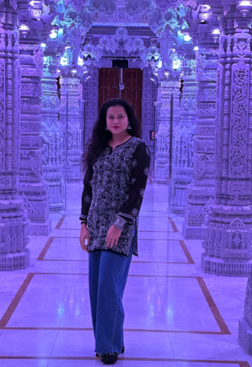

# Padmini Biswal

## Where are you from

I'm from the Indian state of Odisha, specifically the city of Bhubaneswar. which is referred to as the "Temple City" due to the 700 temples that formerly stood there.  It is famed for its stunning antique temples, modern museums , excellent odia food.

## IT Interest

I have an engineering and computer science background. QA engineers were what I had been. My current focus is on information systems, and I'm getting a master's degree in information technology and management. I'm especially interested in the following areas:
a.The first is natural language processing (NLP). 
b. Machine Learning (ML): I continuously pick up new skills from the data I'm exposed to thanks to machine learning algorithms. In order to address pressing issues like enhancing healthcare, halting climate change, and customizing education, I'm interested in investigating fresh and creative approaches that leverage machine learning.

## First Computing Device

My first computing device was a Intel Pentium 4.

## Something Interesting About You

Dancing is something I adore doing. I studied the Oddissi classical dance form. I also adore going on hikes. I'm also skilled at sports. I've played badminton at the state level.
